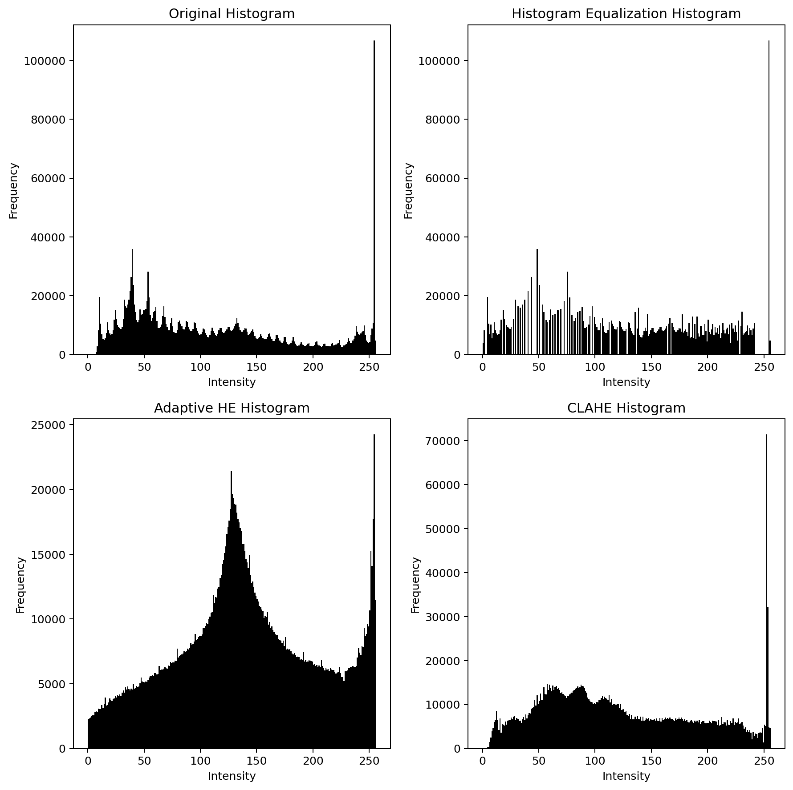

# Histogram-Based Image Enhancement

This project applies three histogram-based enhancement methods to `selfie.jpg` and compares their visual and quantitative effects on the grayscale image.

The notebook used for the experiment is `histogram_image_enhancement.ipynb`.

## Original Image

The original input image used in this project is shown below.

## Methods

The following techniques were applied:

- Histogram Equalization
- Adaptive Histogram Equalization (AHE)
- Contrast Limited Adaptive Histogram Equalization (CLAHE)

Each method was evaluated against the original grayscale image using:

- SSIM
- PSNR
- MSE

## Result Images

### Image Comparison

The figure below compares the original grayscale image used for processing with the three enhanced results.

### Histogram Comparison

The figure below shows how each method redistributes pixel intensities.

## Quantitative Results

| Method | SSIM | PSNR | MSE |
| --- | ---: | ---: | ---: |
| Histogram Equalization | 0.9275 | 20.6598 | 558.5953 |
| Adaptive Histogram Equalization | 0.3000 | 9.3176 | 7608.9343 |
| CLAHE | 0.8795 | 19.3203 | 760.4154 |

## Discussion

Histogram Equalization improves global contrast and spreads intensity values across a wider range. In the result image, the face and background become more separated, and the histogram is much more evenly distributed than the original. Its high SSIM and relatively low MSE indicate that it enhances contrast while still preserving the original structure reasonably well.

Adaptive Histogram Equalization produces the strongest local contrast enhancement. Fine details become more visible, but the image also looks much harsher and less natural. This is reflected in the histogram and in the metrics: AHE has the lowest SSIM, the lowest PSNR, and the highest MSE, which means it changes the original image the most.

CLAHE balances enhancement and stability. It improves local contrast like AHE, but limits over-amplification in homogeneous regions. In the result image, CLAHE preserves facial structure better than AHE and avoids excessive noise boosting. Its SSIM and PSNR are lower than standard histogram equalization but much better than AHE, making it the most visually balanced method for this image.

## Conclusion

For `selfie.jpg`, standard histogram equalization gives the best similarity-based scores, while CLAHE provides the most practical visual tradeoff between contrast improvement and artifact control. AHE enhances local detail aggressively, but it also introduces the largest distortion relative to the original image.
