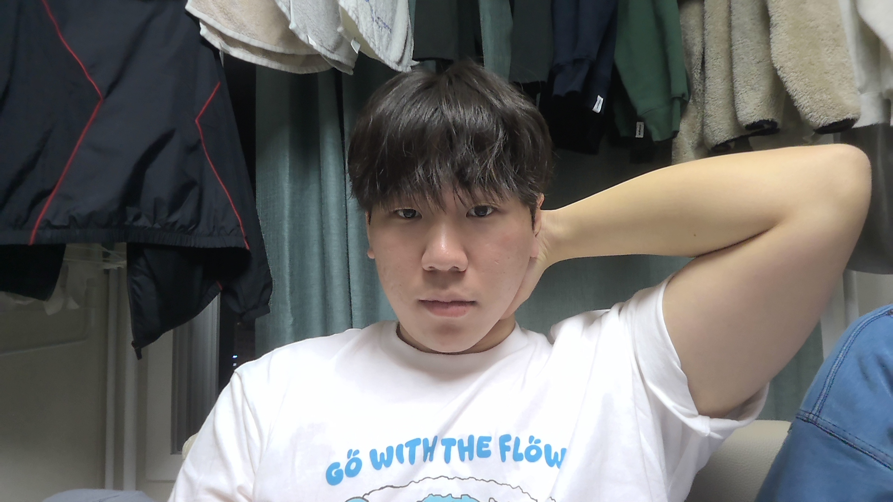
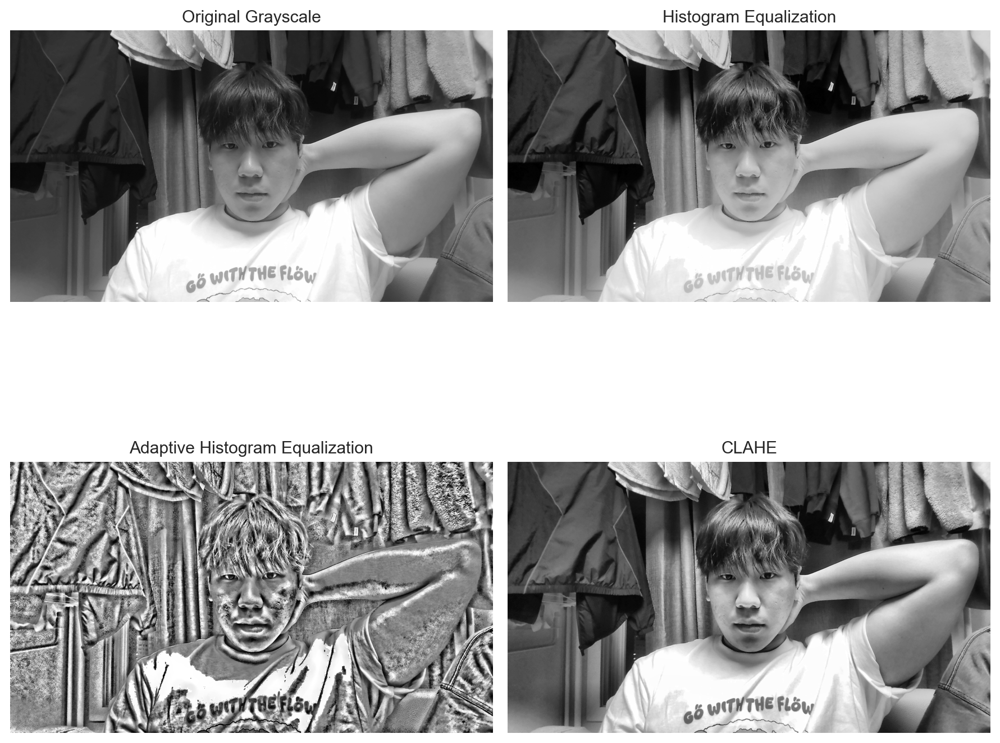
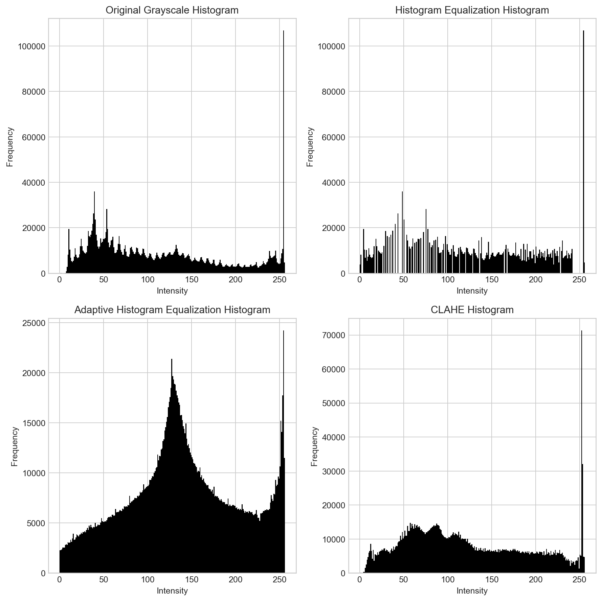
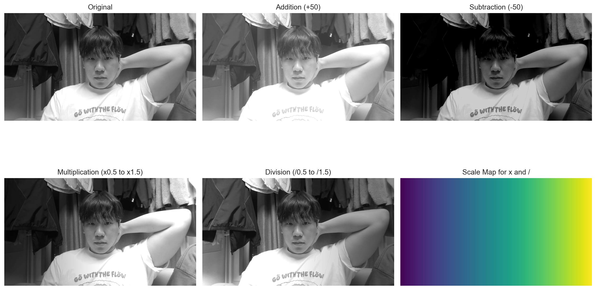
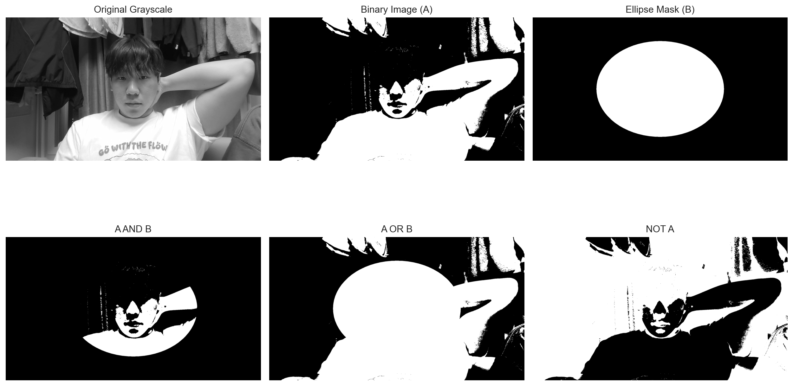
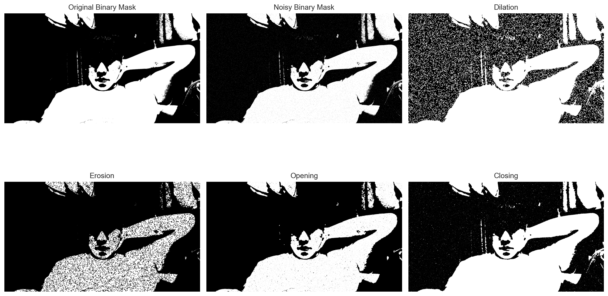

# Computer Graphics Image Processing Report

This repository contains four separate notebook files that demonstrate core image processing techniques using `selfie.jpg`.

## Input Image

The original image used throughout the report is shown below.

## Notebook Files

1. `1_histogram_image_enhancement.ipynb`
2. `2_arithmetic_operations.ipynb`
3. `3_logical_operations.ipynb`
4. `4_morphological_operations.ipynb`

## 1. Histogram-Based Image Enhancement

This experiment enhances the grayscale version of the input image using three histogram-based methods:

- Histogram Equalization
- Adaptive Histogram Equalization (AHE)
- Contrast Limited Adaptive Histogram Equalization (CLAHE)

### Result Images

The following figure compares the original grayscale image with the three enhanced outputs.

The next figure shows how each method changes the distribution of pixel intensities.

### Quantitative Evaluation

| Method | SSIM | PSNR | MSE |
| --- | ---: | ---: | ---: |
| Histogram Equalization | 0.9275 | 20.6598 | 558.5953 |
| Adaptive Histogram Equalization | 0.3000 | 9.3176 | 7608.9343 |
| CLAHE | 0.8795 | 19.3203 | 760.4154 |

### Discussion

Histogram Equalization improves global contrast and gives the best similarity-based scores relative to the original grayscale image. AHE produces the strongest local enhancement, but it also changes the image the most and introduces the largest distortion. CLAHE offers the best visual balance because it improves local contrast while suppressing excessive amplification.

## 2. Arithmetic Operations on Images

This section applies four arithmetic operations to the grayscale image:

- Addition
- Subtraction
- Multiplication
- Division

For a clear demonstration, addition and subtraction use a constant offset image of `50`, while multiplication and division use a horizontal scale map ranging from `0.5` to `1.5`.

### Result Image

### Intensity Summary

| Image | Mean Intensity |
| --- | ---: |
| Original | 111.42 |
| Addition | 155.59 |
| Subtraction | 66.10 |
| Multiplication | 115.22 |
| Division | 109.89 |

### Discussion

Addition brightens the entire image and shifts intensities upward. Subtraction darkens the image and suppresses low-intensity regions. Multiplication changes contrast according to the scale map, which makes one side darker and the other side brighter. Division produces the inverse effect of multiplication and redistributes brightness in the opposite direction.

## 3. Logical Operations on Images

This section performs logical operations on binary images:

- AND
- OR
- NOT

The grayscale selfie image is first converted to a binary image using Otsu thresholding. A filled ellipse mask is then used as the second operand for the logical operations.

### Result Image

### White Pixel Ratio

| Image | White Pixel Ratio |
| --- | ---: |
| Binary Image (A) | 0.3638 |
| Ellipse Mask (B) | 0.2621 |
| A AND B | 0.0985 |
| A OR B | 0.5273 |
| NOT A | 0.6362 |

### Discussion

The AND operation preserves only the overlapping foreground region between the thresholded image and the ellipse mask. OR combines the foreground areas from both images and therefore produces the largest visible region. NOT inverts the binary image, swapping foreground and background completely.

## 4. Morphological Operations

This section demonstrates four morphological operations on a binary image:

- Dilation
- Erosion
- Opening
- Closing

To make the effect easier to observe, a small amount of salt-and-pepper noise is added to the thresholded binary image before applying the operations. A `5 x 5` rectangular structuring element is used.

### Result Image

### White Pixel Ratio

| Image | White Pixel Ratio |
| --- | ---: |
| Original Binary Mask | 0.3638 |
| Noisy Binary Mask | 0.3665 |
| Dilation | 0.5308 |
| Erosion | 0.2589 |
| Opening | 0.3471 |
| Closing | 0.3839 |

### Discussion

Dilation expands the white foreground regions, while erosion shrinks them. Opening removes small bright noise and smooths thin protrusions, so the white ratio decreases slightly. Closing fills small gaps and holes inside the foreground, which increases the white ratio compared with the noisy mask.

## Conclusion

The four notebooks cover contrast enhancement, arithmetic image manipulation, logical mask-based processing, and morphological shape processing. Together, they show how the same input image can be analyzed and transformed through different classes of image processing operations for both visual interpretation and structural manipulation.
